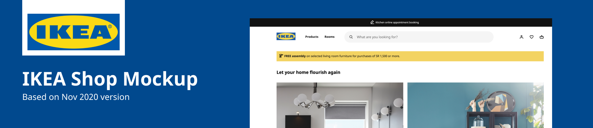

# IKEA Shop Clone

A shop clone for IKEA Saudi Arabia Shop

The project is hosted statically at Github Pages [View demo](www.turkinass.github.io/IKEA-Clone/public/index.html)

You may compare it to the original website that we based it on www.ikea.com/sa/en/, yet take into account that the website may change since we worked on it.

## :bookmark_tabs: About The Project
This project was made as a part of SWE 363 (Web Engineering and Development) course

## :computer: Team
The project was made by Turki Alsaedi (me), Mohannad Bawazeer [@Mohannadbawazer](https://www.github.com/Mohannadbawazer) and Ziyad Alwaghdani

